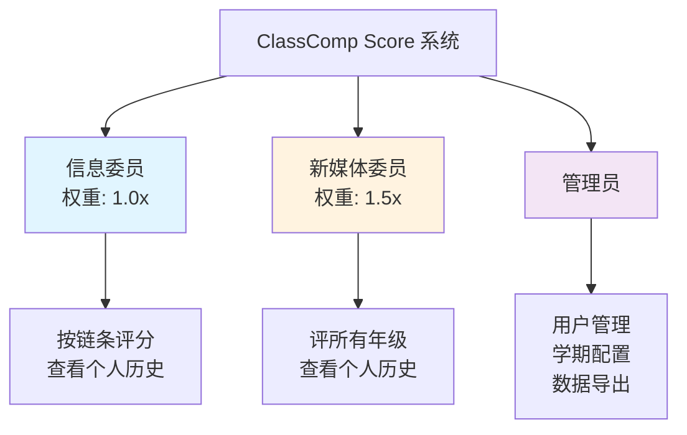
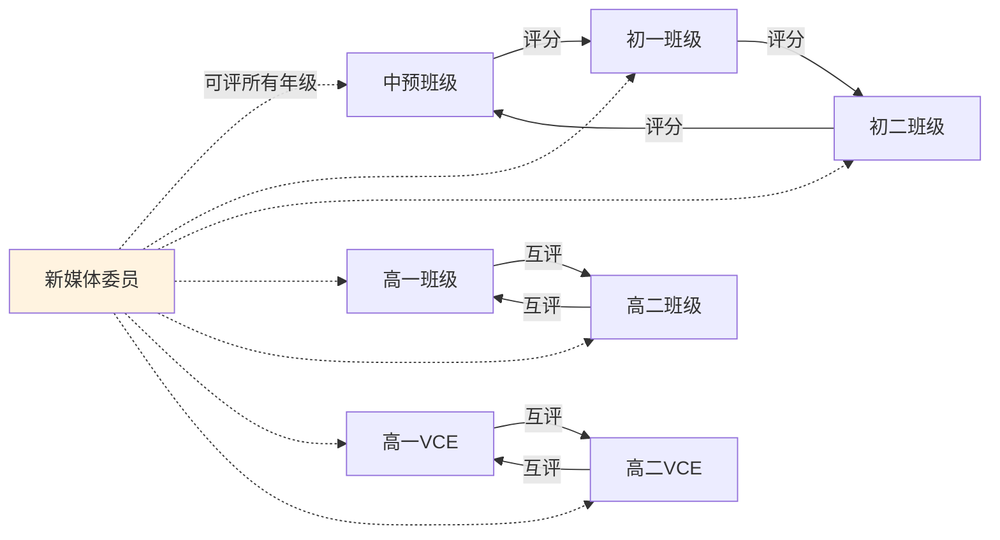
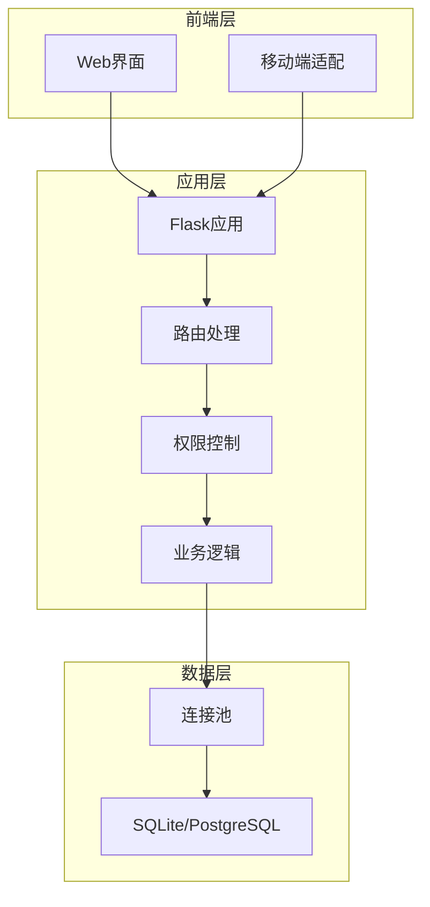

# 文档重构方案 v2.0

## 📋 重构目标

根据源代码实际实现，重新组织项目文档，确保文档与代码功能完全一致。

## 🎯 核心原则

1. **实事求是**：所有文档内容必须基于源代码实际功能
2. **角色明确**：只介绍三个核心用户角色
3. **结构清晰**：使用者文档和开发者文档分离
4. **易于维护**：文档结构简洁，便于后续更新

## 👥 系统角色定义（基于源代码）

### 三个核心用户角色

1. **信息委员（student）**
   - 系统中最基础的评分人员
   - 权重：1.0倍
   - 主要功能：
     - 按照评分链条对指定年级班级进行评分
     - 查看个人评分历史
     - 评分周期内可覆盖之前的评分

2. **新媒体委员（new_media_officer）**
   - 特殊的高权重评分人员
   - 权重：1.5倍
   - 主要功能：
     - 可以对所有年级进行评分（不受评分链条限制）
     - 评分记录标记为"新媒体委员"来源
     - 查看个人评分历史
     - 评分周期内可覆盖之前的评分

3. **管理员（admin）**
   - 系统最高权限用户
   - 主要功能：
     - 用户管理（创建、删除、重置密码）
     - 学期配置（学期信息、评分周期、参与班级）
     - 权重配置（新媒体委员和信息委员的评分权重）
     - 数据导出和备份
     - 查看所有统计数据
     - 周期类型动态切换

### 隐藏角色（不在用户文档中介绍）

- **teacher角色**：代码中存在但仅用于数据查看，不作为独立用户类型介绍

## 📁 新的文档结构

```
docs/
├── README.md                          # 文档导航
├── quick-start.md                     # 快速开始（保持现有）
├── features.md                        # 功能特性（更新角色说明）
├── TROUBLESHOOTING.md                 # 故障排除（保持现有）
│
├── user-guide/                        # 使用者文档
│   ├── README.md                      # 使用者文档导航（重写）
│   ├── info-commissioner-guide.md     # 信息委员使用手册（新建）
│   ├── new-media-officer-guide.md     # 新媒体委员使用手册（新建）
│   ├── admin-guide.md                 # 管理员使用手册（更新）
│   └── dynamic-period-usage.md        # 动态周期使用指南（保持）
│
├── development/                       # 开发者文档
│   ├── README.md                      # 开发者文档导航（更新）
│   ├── architecture.md                # 系统架构说明（新建）
│   ├── database-schema.md             # 数据库设计（新建）
│   ├── api-reference.md               # API参考（新建）
│   └── implementation-plans/          # 实现计划（保持现有）
│
└── deployment/                        # 部署文档（保持现有结构）
    ├── README.md
    ├── local-deployment.md
    ├── production-deployment.md
    └── ...
```

## 📝 具体重构任务

### 1. README.md（项目根目录）

**目标**：提供项目的总体概述

**内容要点**：
- 项目简介：一句话说明项目用途
- 核心特性：列出3-5个最重要的功能
- 三个用户角色的简要说明
- 快速开始链接
- 技术栈概览
- 文档导航（链接到各个文档分类）
- 许可证和贡献说明

### 2. docs/user-guide/README.md

**目标**：使用者文档的导航页

**内容结构**：
```markdown
# 使用者手册

## 角色导航
- 👨‍🎓 **信息委员** → [信息委员使用手册](info-commissioner-guide.md)
- 📹 **新媒体委员** → [新媒体委员使用手册](new-media-officer-guide.md)
- 👨‍💼 **管理员** → [管理员使用手册](admin-guide.md)

## 功能文档
- 🔄 **动态周期功能** → [动态周期使用指南](dynamic-period-usage.md)
```

### 3. info-commissioner-guide.md（新建）

**内容来源**：基于现有的 `officer-guide.md`，但需要：
- 明确角色定位：基础评分人员，权重1.0倍
- 说明评分链条规则（中预→初一→初二→中预，高一↔高二，高一VCE↔高二VCE）
- 基于实际代码功能描述操作流程
- 移除所有"教师"相关内容

**章节结构**：
1. 角色职责
2. 登录和首次使用
3. 评分流程
4. 评分规则和标准
5. 查看评分历史
6. 评分周期说明
7. 移动端使用
8. 常见问题

### 4. new-media-officer-guide.md（新建）

**内容来源**：基于 `new_media_officer_index.html` 模板和代码功能

**章节结构**：
1. 角色职责和特殊权限
   - 1.5倍评分权重
   - 可评所有年级
   - 评分来源标记
2. 登录和界面说明
3. 年级选择和评分流程
4. 毕业班级专项检查说明
5. 评分规则和标准
6. 查看评分历史
7. 移动端使用
8. 常见问题

### 5. admin-guide.md（更新）

**更新内容**：
- 移除所有"教师"角色相关内容
- 更新用户管理章节，只介绍三个角色
- 更新权重配置章节，说明新媒体委员和信息委员的权重设置
- 确保所有功能说明与代码实现一致

**保留章节**：
- 管理员职责
- 用户管理
- 学期配置
- 动态周期管理
- 权重配置
- 数据导出和备份
- 安全管理
- 常见问题

### 6. features.md（更新）

**更新内容**：
- 多角色权限系统章节：更新为三个角色
- 移除教师监控面板相关描述
- 更新权重说明：明确新媒体委员1.5倍，信息委员1.0倍

### 7. development/ 目录（新建/更新）

创建完整的开发者文档：

#### architecture.md（新建）
- 系统架构概述
- 技术栈详解
- 目录结构说明
- 核心模块介绍
- 安全机制

#### database-schema.md（新建）
- 数据库表结构
- 表关系图
- 字段说明
- 索引设计

#### api-reference.md（新建）
- RESTful API端点列表
- 请求/响应示例
- 认证机制
- 错误处理

## 🗑️ 需要删除/移动的文件

1. **删除**：`docs/user-guide/teacher-guide.md`
2. **检查并更新**：所有引用"教师"角色的文档

## ✅ 验证清单

完成重构后需要验证：

- [ ] README.md 准确反映项目核心功能
- [ ] 所有角色说明与代码一致（只有三个角色）
- [ ] 每个用户角色都有清晰的使用手册
- [ ] 没有遗留的"教师"角色引用（除非是在代码层面的说明）
- [ ] 所有功能描述都基于实际代码实现
- [ ] 文档之间的链接正确
- [ ] 图表和示例准确
- [ ] 移动端功能说明完整
- [ ] 开发者文档完整且准确

## 🎨 Mermaid 图表规划

### 角色关系图



### 评分链条图



### 系统架构图



## 📊 实施优先级

### 高优先级（立即执行）
1. 重写 README.md
2. 重写 docs/user-guide/README.md
3. 创建 info-commissioner-guide.md
4. 创建 new-media-officer-guide.md
5. 更新 admin-guide.md
6. 删除 teacher-guide.md

### 中优先级（随后执行）
7. 更新 features.md
8. 创建 development/architecture.md
9. 创建 development/database-schema.md

### 低优先级（可选）
10. 创建 development/api-reference.md
11. 优化现有部署文档

## 📅 预计时间

- 高优先级任务：2-3小时
- 中优先级任务：1-2小时
- 低优先级任务：1小时

总计：4-6小时

## 🔄 后续维护

建议每次代码功能更新时：
1. 同步更新对应的用户手册
2. 更新 features.md 中的功能列表
3. 如有API变更，更新开发者文档
4. 定期检查文档链接的有效性